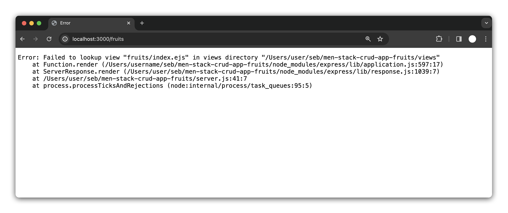

<h1>
  <span class="headline">Fruits</span>
  <span class="subhead">Build the Fruits Index Page</span>
</h1>

**Learning objective:** By the end of this lesson, students will be able to build an express route that will find and render all of the fruits in the database.

## The `index` route

Now that we have created a way for users to add fruits to our database, the next step is to display these fruits. In this section, we will develop the Index Route. This route will retrieve and display all the fruits currently stored in our database. 

In keeping with RESTful routing conventions, the `url` for this route will be: `/fruits`.

## Define the route

Let's start by defining and testing the route. Add the following code to `server.js`, beneath the landing page route `/` and above the `/fruits/new` route:

```js
// GET /fruits
app.get("/fruits", (req, res) => {
  res.send("Welcome to the index page!");
});
```

Test it by visiting [localhost:3000/fruits](http://localhost:3000/fruits). You should see your message in the browser: "Welcome to the index page!"

## Retrieve all `fruit` data

Now that we know our route is set up, our next step is to retrieve data from the database. In this case, we are looking for all of the fruits. To accomplish this, we'll use Mongoose's `.find()` method. When called without any arguments, `.find()` retrieves all documents within a collection, returning them as an array.

Let's use `.find()` inside our route:

```js
app.get("/fruits", async (req, res) => {
  const allFruits = await Fruit.find();
  res.send("Welcome to the index page!");
});
```

In the above snippet, we've modified our route to be an asynchronous function. This allows us to use the `await` keyword to wait for `.find()` to complete its operation and assign the result to the `allFruits` variable.

To be sure we have the data we are looking for, let's log `allFruits` to the console:

```js
app.get("/fruits", async (req, res) => {
  const allFruits = await Fruit.find();
  console.log(allFruits); // log the fruits!
  res.send("Welcome to the index page!");
});
```

Now when we navigate to [localhost:3000/fruits](http://localhost:3000/fruits) we should see an array of our fruit data logged to our terminal.


## Update the route

Now that we've successfully retrieved the fruit data from our database, our next objective is to display this data to the user. Up until now, our route's callback function has been using `.send()` to deliver a simple message to the user. However, we need to move beyond this to provide a more dynamic and data-driven experience.

In our context, dynamic HTML refers to HTML content generated based on data. It's not static but changes according to the data we pass to it. We will use EJS templates to create such dynamic HTML pages. These templates will be populated with data from our database each time we render them.

Instead of `.send()`, we will use `.render()` to respond with a dynamically generated HTML view. The `.render()` method takes two arguments:

- The first argument is a `string` specifying the path to the EJS template we wish to render. In our case, it's 'fruits/index.ejs'.

- The second argument is an `object` containing the data we want to pass to the template. This data is provided as key/value pairs, where the key is the name we'll use to reference the data in our EJS template.

We'll pass the `allFruits` data to our template under the key `fruits`. This way, our EJS template can use `fruits` to access and display the data:

```js
app.get("/fruits", async (req, res) => {
  const allFruits = await Fruit.find();
  res.render("fruits/index.ejs", { fruits: allFruits });
});
```

Now if we navigate to [localhost:3000/fruits](http://localhost:3000/fruits) we'll see... an error!



However, this error is actually quite helpful. It points us toward our next step. The message indicates a specific issue: we're attempting to render a view called `index.ejs` located in the `views/fruits` directory, but this file does not currently exist. Let's fix that! 

## Create the `index` template

Now that the route is set up, let's create the template. Create an `index.ejs` file inside the `views/fruits` directory:

```bash
touch views/fruits/index.ejs
```

Inside this template file, add the following HTML boilerplate:

```html
<!-- views/fruits/index.ejs -->

<!DOCTYPE html>
<html lang="en">
  <head>
    <meta charset="UTF-8" />
    <meta name="viewport" content="width=device-width, initial-scale=1.0" />
    <title>Fruits Index</title>
  </head>
  <body>
    <h1>All Fruits</h1>
  </body>
</html>
```

Now if we refresh the browser at [localhost:3000/fruits](http://localhost:3000/fruits) that should resolve our error and render the `<h1>`.

In our previous step, we used `res.render()` to pass the fruits data from our database to the EJS file. By passing `{ fruits: allFruits }`, we made the `allFruits` array accessible in our EJS file as a variable named `fruits`.

We can list our fruits in a simple, bulleted list format using an unordered list `<ul>`. This is done by looping over the fruits array and dynamically generating an `<li>` for each fruit's name: 

```html
<!-- views/fruits/index.ejs -->

<body>
  <h1>All Fruits</h1>
  <ul>
    <% fruits.forEach(fruit => { %>
      <li><%= fruit.name %></li>
    <% }); %>
  </ul>
</body>

```

Another refresh at [localhost:3000/fruits](http://localhost:3000/fruits) and we should see our list!


Congrats! You have just completed your second piece of CRUD functionality, Read!

## Update 'create' route redirect

Now that we have an `index` page displaying all our fruits, it's a good idea to update our `create` route. Instead of redirecting users back to the form after adding a new fruit, we can redirect them to the `index` page. This is a better user experience because they can immediately see the result of adding a new fruit to the database. 

```javascript
// server.js

// POST /fruits
app.post("/fruits", async (req, res) => {
  if (req.body.isReadyToEat === "on") {
    req.body.isReadyToEat = true;
  } else {
    req.body.isReadyToEat = false;
  }
  await Fruit.create(req.body);
  res.redirect("/fruits"); // redirect to index fruits
});
```

## Adding links

Now that our index page is up and running, it's time to make some of our pages more accessible. 

First, we'll add a link on the homepage of our application that users can click to visit the index page. This link will be labeled "Browse Fruits" and will direct users to the index page where they can view all the fruits listed.

Add the following HTML snippet to the application homepage:

```html
<!-- views/index.ejs -->
<a href="/fruits">Browse Fruits</a>
```

Next, let's add a link on the `index` page of our application. This link will be labeled "Add Fruit" and will direct users to the `new` page where they can input details for a new fruit.

Add the following HTML snippet to the fruit `index` page:

```html
<!-- views/fruits/index.ejs -->
<a href="/fruits/new">Add New Fruit</a>
```

Once on the `new` page, we should probably give users an easy way back to index.

Add the following to the fruit `new` page:

```html
<!-- views/fruits/new.ejs -->
<a href="/fruits/">Back to Fruits</a>
```